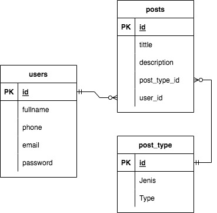

# News App

<!-- ABOUT THE PROJECT -->

## 💻 About The Project

News app can posting articles for media.

Features in News App :

### <summary>USERS</summary>

<!---

  | Command | Description |

| --- | --- |

  --->

At users, there are features for login either user or admin, we also make CRUD for the user here

<div>
<details>
| Feature User | Endpoint | Param | JWT Token | Function |

| ------------ | -------- | ----- | --------- | -------- |

| POST | /register  | - | NO | new account registration |

| POST | /login | - | NO | login for user/admin |

</details>
</div>

<br>

### <summary>POSTS</summary>

<!---

  | Command | Description |

| --- | --- |

  --->

At posts, we can be posting articles by user. so, you must be register and login, before posting article.

<div>
<details>
| Feature Post | Endpoint | Param | JWT Token | Function |

| ------------ | -------- | ----- | --------- | -------- |

| POST | /posts | - | YES | create posting |

| GET | /posts | - | YES | get posts |

| PUT | /posts/id | id: post_id | YES | update post |

| DELETE | /posts/id | id: post_id | YES | delete post |

| POST | /posts/categories | - | YES | create post type |

| GET | /posts/categories | - | YES | get post type |

| PUT | /posts/categories/id | id: post_type_id | YES | update post type |

| DELETE | /posts/categories/id | id: post_type_id | YES | delete post type |

</details>
</div>

<br>

### 🛠 &nbsp;Build App & Database


## 🗃️ ERD



## Run Locally

Clone the project

```bash

  git clone https://github.com/myusuf4892/newsapp.git

```

Go to the project directory

```bash

cd newsapp

```

## Open Api

if you want to consume our api,

here's the way !

```bash

https://app.swaggerhub.com/apis/myusuf4892/newsapp/1.0

```

## Authors

- Muhamad Yusup

  Reach me:

[](https://www.linkedin.com/in/muhamad-yusup-a69225234/)

[](https://github.com/syawaladiyaksa15)

<p align="right">(<ahref="#top">back to top</a>)</p>

<h3>

<p align="center">:copyright: 2022 </p>

</h3>

<!-- end -->
